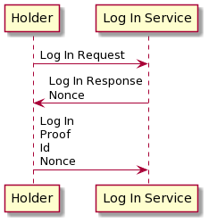
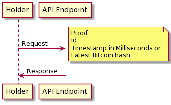

[![Crate][crate-image]][crate-link]
[![Docs][docs-image]][docs-link]
![Apache 2.0][license-image]

# Oberon
A succinct ZKP protocol for authentication. It works by using techniques similar to
Identity-Based/Attribute-Based signatures.

**Executive Summary**: Oberon allows endpoints to issue multi-factor capable
tokens to consumers who can prove their validity *without* disclosing the
tokens themselves and without requiring email, SMS, or authenticator apps.
Endpoints only need to store a single public key and not any tokens. An
attacker that breaks into the server doesn't have any password/token files to
steal and only would see a public key. The proof of token validity is only 96
bytes while the token itself is only 48 bytes. The issuing party and verifying
servers can be separate entities.

## In depth details

The cryptography can be found [here](CRYPTO.md)

First steps require generating keys

The secret key can be generated using distributed key generation methods also but is outside the scope of this crate.

The public key can be given to any party that needs to verify tokens and token proofs.

Tokens are generated for parties that need to authenticate. API endpoints or users can be token holders.

```rust
use oberon::*;
use rand::prelude::*;

fn main() {
    let mut rng = thread_rng();
    let sk = SecretKey::new(&mut rng);
    let pk = PublicKey::from(&sk);
    
    // identifier for a user
    let id = b"abc@example.com";
    let token = Token::new(&sk, id).unwrap(); //only None if identifier yields invalid data
    
    assert_eq!(token.verify(pk, id).unwrap_u8(), 1u8);

    // Generated by the verifier
    let nonce = b"123456789012345678901234567890";
    
    // Token holder makes a proof, no blindings (more on that later)
    let proof = Proof::new(&token, &[], id, nonce, &mut rng).unwrap(); // only None if identifier yields invalid data
    
    // Verifier receives the proof
    assert_eq!(proof.open(pk, id, nonce).unwrap_u8(), 1u8);
    
    // Blindings can be applied to support multi-factor authentication and keeps the token from being stored in plaintext.
    // Pin number
    let b1 = Blinding::new(b"1234");
    
    // HSM secret
    let b2 = Blinding::new(b"0102d9d1-4777-40e4-9217-1e2d9591706c");
    
    let blinding_token = token - b1;
    let blinding_token = blinding_token - b2;

    // Token holder makes a proof, with two blindings
    let proof = Proof::new(&blinding_token, &[b1, b2], id, nonce, &mut rng).unwrap(); // only None if identifier yields invalid data


    // Verifier receives the proof, no blindings required
    assert_eq!(proof.open(pk, id, nonce).unwrap_u8(), 1u8);
}
```

The idea is that the protocol can be used in a three-pass model like logging into a service or a single-pass model
for API endpoint use.

Three pass model




One pass model



[//]: # (badges)

[crate-image]: https://img.shields.io/crates/v/oberon.svg
[crate-link]: https://crates.io/crates/oberon
[docs-image]: https://docs.rs/oberon/badge.svg
[docs-link]: https://docs.rs/oberon/
[license-image]: https://img.shields.io/badge/license-Apache2.0-blue.svg
